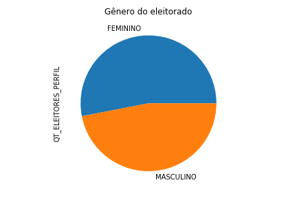

# Perfil dos eleitores e eleitoras de Divinópolis, MG

Analisamos o perfil do eleitorado de Divinópolis, MG, com base nos dados de 2018 do TSE:

<http://www.tse.jus.br/eleicoes/estatisticas/repositorio-de-dados-eleitorais-1/repositorio-de-dados-eleitorais>

As dimensões disponíveis para a análise são:

1. Gênero;

2. Faixa etária;

3. Estado civil; e

4. Escolaridade.

Os dados brutos de Divinópolis estão na pasta [dados](dados), e os gráficos que descrevem o eleitorado estão na pasta [plots](plots).
A análise foi feita em Python notebook (veja o arquivo [exploracao\_dados\_divinopolis_MG.ipynb](exploracao_dados_divinopolis_MG.ipynb)).

## Perfil do eleitorado como um todo

Em 2018, o número de eleitores era igual a 163.331. Eles se distribuem nas dimensões disponíveis da seguinte forma:

## Perfil das mulheres

Em 2018, existiam 86.652 eleitoras mulheres. Elas se distribuem da maneira abaixo:

### Recortes mais específicos entre as mulheres

#### Distribuição de estado civil para mulheres de diferentes escolaridades

Entre as mulheres com ensino médio, predominam as solteiras; entre as com ensino fundamental incompleto, as casadas.
Mas em todos os casos, a quantidade de mulheres casadas é alta:

#### Distribuição de faixa etária para mulheres de diferentes escolaridades

Os dados indicam que mulheres mais escolarizadas tendem a ser mais jovens; mulheres com baixa escolaridade são, em média, mais velhas.

## Perfil mais semelhante a uma jovem candidata

Verificamos que as mulheres com, no mínimo, ensino médio completo e até 44 anos totalizam 29.679 eleitoras.

## Créditos

Henrique S. Xavier - <https://github.com/hsxavier>
